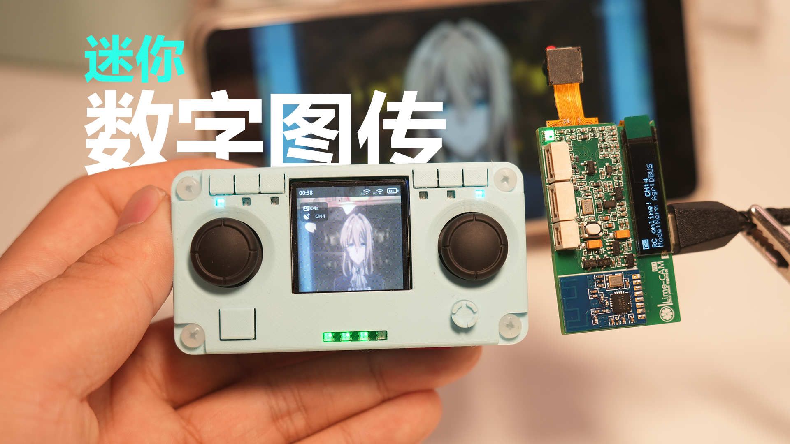

# LimeRC
数字图传遥控器系统 基于NRF24L01

Digital Video Transmission Remote &amp; Receiver（Based on NRF24L01）


# 详细介绍
> 请跳转立创开源广场查看：
 https://oshwhub.com/phantom001/limerc3-1_release

# 如何获取仓库?

## 使用以下链接获取仓库：

> 遥控器主板程序使用了LVGL Release v9.3，通过submodule的方式引入，请确保使用git clone --recurse-submodules命令克隆仓库。

```
git clone --recurse-submodules https://github.com/pingyun001/LimeRC.git
```
如果已经克隆，可通过如下命令更新submodule：
```
git submodule init
git submodule update
```

## 固件编译

详情参考SOFTWARE文件夹

## 固件下载

推荐使用keil 5MDK 内置下载功能进行下载

若使用CubeProgrammer, 可使用ST-Link配套下载

!!注意 遥控器主板无法通过ST-Link+CubeProgrammer下载，可通过USB下载（按住BOOT键后插入USB到电脑）

# 联系作者

欢迎通过BiliBili私信：
https://space.bilibili.com/336483389

工作忙，尽量24小时内回复
